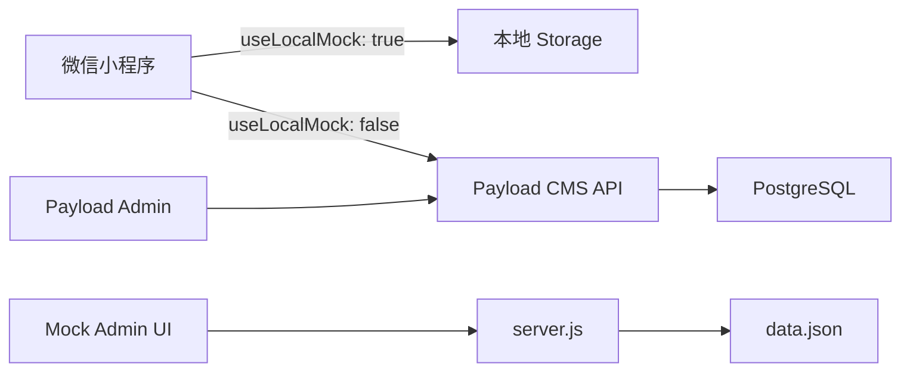
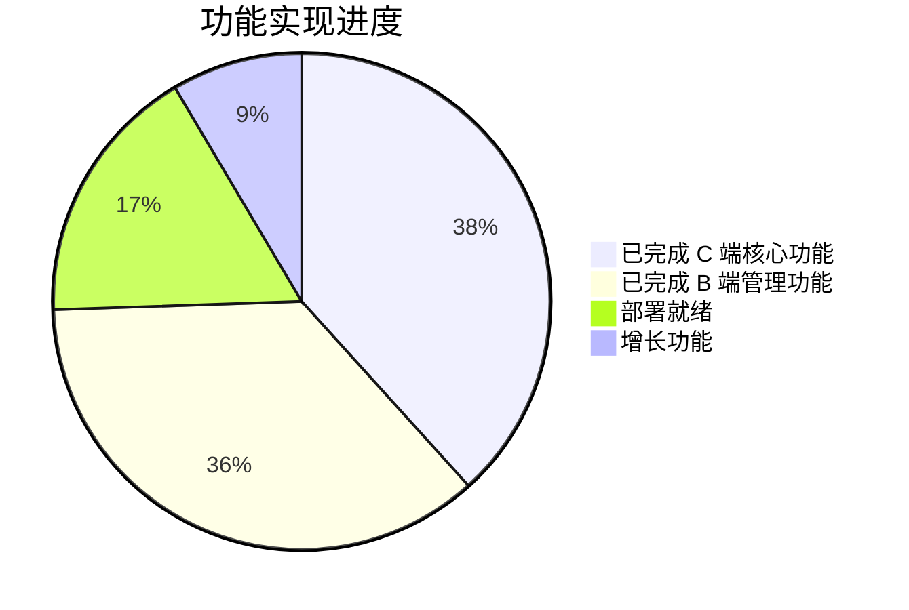

# 学校商铺招商小程序 — 全面代码审计报告

> 审计时间：2026-06-28 | 审计范围：小程序端 (mp/)、Payload CMS 后端 (backend/)、Mock 服务与基础设施

---

## 一、项目总览

本项目是一个**学校商铺招商管理系统**，包含三个核心子系统：

| 子系统 | 技术栈 | 用途 |
|--------|--------|------|
| `mp/` 微信小程序 | 原生小程序框架 | C 端用户浏览项目、提交咨询线索 |
| `backend/` Payload CMS | Next.js + Payload + PostgreSQL | 生产后端 API + CMS 管理后台 |
| `admin/` + `server.js` | 静态 HTML + Node.js | 本地 Mock 演示工具 |

**数据流**：

---

## 二、综合评分总览

| 维度 | 小程序 | 后端 | 基础设施 | 综合 |
|------|--------|------|----------|------|
| 代码质量 | ★★★★☆ | ★★★★☆ | ★★★★☆ | **★★★★☆** |
| 安全性 | ★★★★☆ | ★★★☆☆ | ★★★★☆ | **★★★½☆** |
| UI/UX 设计 | ★★★★☆ | ★★★★☆ | ★★★★☆ | **★★★★☆** |
| 架构与可扩展性 | ★★★★☆ | ★★★☆☆ | ★★★★☆ | **★★★½☆** |
| 文档完整性 | — | — | ★★★★★ | **★★★★★** |

---

## 三、安全审计发现

### 🔴 Critical（关键安全问题）

#### 1. Projects 集合读权限过于宽松
- **文件**：[Projects.ts](file:///d:/work/zhaoshang/backend/collections/Projects.ts) L25
- **问题**：`read: () => true` 使得所有项目（包括草稿、已拒绝）通过 Payload 原生 REST API `/api/payload/projects` 对未认证用户可见
- **影响**：未发布内容泄露
- **建议**：将 read 改为 `isStaffUser` 或增加 `auditStatus` 过滤条件

#### 2. 自定义 GET /api/projects 泄露草稿
- **文件**：[projects/route.ts](file:///d:/work/zhaoshang/backend/app/api/projects/route.ts) L19-22
- **问题**：不带 `?public=true` 参数时返回所有项目（含草稿），且无认证要求
- **影响**：任何人可获取未发布项目列表
- **建议**：默认只返回公开项目，需查看全部时要求 staff 认证

#### 3. DELETE /api/projects 权限绕过
- **文件**：[projects/[id]/route.ts](file:///d:/work/zhaoshang/backend/app/api/projects/%5Bid%5D/route.ts) L59-73
- **问题**：路由使用 `getAuthenticatedStaff('projects')` 允许 advisor/editor 删除，但集合级别限制为 admin-only。由于使用 `overrideAccess: true`，集合级限制被绕过
- **建议**：在路由层也检查 `isAdminUser`，或移除 `overrideAccess`

#### 4. mapProject 暴露内部字段
- **文件**：[payloadApi.ts](file:///d:/work/zhaoshang/backend/app/api/_shared/payloadApi.ts) L171-211
- **问题**：向公共 API 消费者暴露了 `advisorTips`（招商顾问提示）、`remark`（内部备注）、`trafficTags`、`facilityTags`
- **建议**：在面向小程序的映射中移除内部字段

#### 5. WeChat 开发模式风险
- **文件**：[wechat-login/route.ts](file:///d:/work/zhaoshang/backend/app/api/auth/wechat-login/route.ts) L16-20
- **问题**：`WECHAT_AUTH_MODE` 默认为 `'dev'`，若以 `NODE_ENV=development` 部署，任何人可通过 `x-dev-openid` 获取任意用户 token
- **建议**：在生产环境强制要求 `WECHAT_AUTH_MODE=wechat`，在启动时校验

### 🟡 Important（重要问题）

| # | 问题 | 位置 | 建议 |
|---|------|------|------|
| 6 | Leads `create: () => true` 允许通过 Payload REST API 创建未经过滤的线索 | [Leads.ts](file:///d:/work/zhaoshang/backend/collections/Leads.ts) L28 | 添加 create 钩子进行字段过滤 |
| 7 | `transferDetails`/`equipmentDetails` 子字段未深度校验 | [payloadApi.ts](file:///d:/work/zhaoshang/backend/app/api/_shared/payloadApi.ts) L352-353 | 对嵌套对象做白名单过滤 |
| 8 | mock 服务器仍有手机号旁路查询 | [server.js](file:///d:/work/zhaoshang/server.js) L338-339 | 移除，匹配生产行为 |
| 9 | `wxLogin()` 失败时返回 `'dev'` 而非错误 | [auth.js](file:///d:/work/zhaoshang/mp/services/auth.js) L12-17 | 改为 `reject()` |
| 10 | 无任何 API 端点速率限制 | 后端全局 | 添加 rate limiting 中间件 |

---

## 四、代码质量审计

### 4.1 小程序端 (mp/)

#### ✅ 优点
- **清晰的分层**：`services/api.js` 集中 API 调用、`services/auth.js` 处理认证、`utils/form.js` 提供表单验证、`config.js` 集中常量
- **表单页 WXSS 复用**：transfer 和 equipment 页面通过 `@import "../apply/apply.wxss"` 复用样式
- **全面的错误处理**：每个 API 调用都有 `.catch()` + 用户反馈，401 自动刷新 token
- **完善的状态管理**：加载态、空态、错误态在所有数据页面都有实现

#### ⚠️ 问题

**代码重复严重（★★★☆☆）：**

| 重复模式 | 涉及文件 | 重复行数 |
|----------|----------|----------|
| 表单提交流程（校验→构建→提交→成功处理） | [apply.js](file:///d:/work/zhaoshang/mp/pages/apply/apply.js), [transfer.js](file:///d:/work/zhaoshang/mp/pages/transfer/transfer.js), [equipment.js](file:///d:/work/zhaoshang/mp/pages/equipment/equipment.js) | ~80行 × 3 |
| 图片上传处理（选择/删除/预览） | 同上三个文件 | ~40行 × 3 |
| 收藏切换逻辑 | [index.js](file:///d:/work/zhaoshang/mp/pages/index/index.js) L146, [list.js](file:///d:/work/zhaoshang/mp/pages/list/list.js) L190, [detail.js](file:///d:/work/zhaoshang/mp/pages/detail/detail.js) L82 | ~20行 × 3 |
| 日期格式化 | [equipment-list.js](file:///d:/work/zhaoshang/mp/pages/equipment-list/equipment-list.js) L3, [leads.js](file:///d:/work/zhaoshang/mp/pages/leads/leads.js) L4, [detail.js](file:///d:/work/zhaoshang/mp/pages/detail/detail.js) L44 | ~5行 × 3 |
| Loading/Empty/Error CSS | 5 个页面 WXSS | ~30行 × 5 |

> [!TIP]
> 建议使用微信小程序 `Behavior` 机制将表单提交、图片上传、收藏操作抽取为共享行为模块，可减少 ~400 行重复代码。

**其他问题：**
- `api.js` 混合了真实请求和 mock 数据存储（358行），mock部分应抽离到 `services/mock.js`
- [my.js](file:///d:/work/zhaoshang/mp/pages/my/my.js) L57 内联手机号正则，应复用 `validatePhone()`
- [leads.wxml](file:///d:/work/zhaoshang/mp/pages/leads/leads.wxml) 大量内联 `style` 属性应移至 WXSS

### 4.2 后端 (backend/)

#### ✅ 优点
- TypeScript `strict: true` 启用，基础类型安全有保障
- 集合 schema 设计良好：条件字段、分 tab 组织、seedKey 幂等播种
- `sanitizeLeadCreateInput` / `sanitizeLeadUpdateInput` 白名单过滤正确
- `validateAttachmentOwnership` 附件所有权校验完善
- `mapLead` 正确隐藏 `submitterOpenId` 和 CRM 字段
- 自定义认证使用 `timingSafeEqual` 常量时间比较

#### ⚠️ 问题

| 问题 | 严重度 | 位置 |
|------|--------|------|
| `payloadApi.ts` 425 行 "万能文件"，混合映射/校验/工具 | 中 | [payloadApi.ts](file:///d:/work/zhaoshang/backend/app/api/_shared/payloadApi.ts) |
| 大量 `as never` 类型断言绕过 Payload 泛型 | 低 | 多处（seed-demo.ts, convert/route.ts 等） |
| `stats/route.ts` 无 try-catch，加载全部数据到内存 | 高 | [stats/route.ts](file:///d:/work/zhaoshang/backend/app/api/stats/route.ts) |
| 空 `catch {}` 吞掉错误 | 中 | [projects/[id]/route.ts](file:///d:/work/zhaoshang/backend/app/api/projects/%5Bid%5D/route.ts) L54,71 |
| `getRole` 默认返回 `'advisor'` | 中 | [access.ts](file:///d:/work/zhaoshang/backend/collections/shared/access.ts) L10 |
| 无数据库索引优化 | 中 | 未声明 `status`/`leadType`/`submitterOpenId` 等字段索引 |
| 上传文件存本地文件系统，容器重启丢失 | 高 | 无云存储插件配置 |
| Dockerfile COPY 全部 node_modules 到生产镜像 | 低 | [Dockerfile](file:///d:/work/zhaoshang/backend/Dockerfile) L54 |
| Kanban 硬编码 `#fff` 背景不兼容暗色模式 | 低 | [LeadsKanbanView.tsx](file:///d:/work/zhaoshang/backend/app/admin/components/LeadsKanbanView.tsx) L209 |

### 4.3 基础设施

#### ✅ 优点
- Mock 服务器覆盖 ~80% 生产 API（15 个端点），开发体验好
- Docker 迁移模式优秀：`migrate` 服务确保 schema 就绪后再启动应用
- PostgreSQL 端口限制到 `127.0.0.1`，安全意识好
- 文档质量极高（PRD/UX 审计/上线清单），全部更新至 2026-06

#### ⚠️ 问题
- `docker-compose.yml` 未传递 `WECHAT_*` 环境变量到 payload 服务
- `.env.example` 默认 `WECHAT_AUTH_MODE=dev`
- Mock 数据缺少设备类线索
- `admin/styles.css:973` — `flex-1: 1` 是无效 CSS（应为 `flex: 1`）

---

## 五、UI/UX 分析与改进建议

### 5.1 当前设计亮点 ✨

小程序 UI 整体质量较高，亮点包括：

- **一致的配色系统**：基于 Tailwind 风格的色板，主色 `#3b82f6`，危险色 `#ef4444`，成功色 `#10b981`，全局统一
- **完善的状态反馈**：加载态（自定义 spinner + 描述文字）、空态（emoji + 文案 + 操作按钮）、错误态（标题 + 描述 + 重试）
- **流畅的用户动线**：首页 → 浏览/筛选 → 详情 → 咨询 → 成功 → 查看记录，多入口设计
- **细腻的微交互**：全局 `:active` 按压反馈（opacity + scale）、筛选箭头旋转、模态弹出动画、收藏星星缩放

### 5.2 UI 改进建议

#### 🎯 P0 — 高优先级

| # | 问题 | 现状 | 建议改进 |
|---|------|------|----------|
| 1 | **筛选栏拥挤** | list 页面 6 个 tab 一行排列，窄屏（iPhone SE）非常拥挤 | 改为可横向滚动的 tab 栏，或 2 主 tab + "更多筛选" 抽屉 |
| 2 | **表单验证反馈** | 逐条 `wx.showToast` 弹出，用户只能看到一个错误 | 改为**内联字段级错误**：红色边框 + 字段下方错误提示文字 |
| 3 | **无骨架屏** | 加载时仅显示 spinner，白屏感明显 | 添加骨架屏占位卡片，提升感知加载速度 |
| 4 | **底部安全区域** | 详情页底部操作栏未考虑 iPhone 底部指示条 | 添加 `padding-bottom: env(safe-area-inset-bottom)` |
| 5 | **无分页加载** | list/equipment-list 一次加载全部数据 | 实现**无限滚动**分页，每次加载 20 条 |

#### 🎯 P1 — 中优先级

| # | 问题 | 建议改进 |
|---|------|----------|
| 6 | 收藏图标用 Unicode ☆/★，视觉较弱 | 改用 SVG/图片图标，增大点击热区 |
| 7 | 空态图标用 `□` 字符看起来像乱码 | 替换为有意义的 emoji（如 📭）或插画 |
| 8 | 搜索无防抖，每次输入都触发请求 | 添加 300ms `debounce` |
| 9 | 详情页不支持下拉刷新 | 在 detail.json 中启用 `enablePullDownRefresh` |
| 10 | 图片加载失败时显示空白 | 添加 `binderror` 处理，显示占位图 |
| 11 | 仅详情页有分享功能 | 为首页和列表页也添加 `onShareAppMessage` |
| 12 | 无"回到顶部"按钮 | 列表页长滚动后显示浮动回顶按钮 |

#### 🎯 P2 — 低优先级

| # | 建议 |
|---|------|
| 13 | 长表单（转让/设备）添加草稿自动保存 |
| 14 | leads 页面内联 style 移至 WXSS |
| 15 | 添加深色模式支持 |
| 16 | 状态标签增加图标/纹理辅助区分（当前仅靠颜色） |

### 5.3 无障碍性（★★☆☆☆ — 需改进）

> [!WARNING]
> 当前无障碍支持严重不足，建议逐步改善：

- **无 ARIA 标签**：所有 WXML 模板均缺少 `aria-label`、`aria-role` 属性
- **颜色唯一区分**：状态徽章（在线/即将/已满）仅靠颜色区分，色觉障碍用户无法识别
- **无 `aria-expanded`**：leads 页面可展开的时间线缺少展开状态标注
- **emoji 图标无替代文本**：分类图标（🍜🏬🍔）对屏幕阅读器不友好

### 5.4 Admin 管理后台 UI

**Payload 自定义组件质量良好**，6 个组件覆盖了核心工作流：

| 组件 | 质量 | 备注 |
|------|------|------|
| OperationsDashboard | ★★★★☆ | 色彩编码统计卡 + 快捷操作 |
| LeadsKanbanView | ★★★★☆ | HTML5 拖拽看板，但硬编码白色背景 |
| LeadFollowTimeline | ★★★★★ | 时间线 + 内联创建，自动状态联动 |
| LeadQuickActions | ★★★★☆ | 一键复制电话、关联商户、转化 |
| MerchantProfileLeadsPanel | ★★★★☆ | 商户关联线索面板 |
| ProjectEditHints | ★★★☆☆ | 较简单，可加运营提示 |

**改进建议**：
- 将内联样式迁移到 CSS Modules，提高可维护性
- 硬编码颜色（`#2563eb`、`#b45309`、`#fff`）改用 Payload 主题变量（`var(--theme-*)`)
- Kanban 卡片适配暗色模式

**Mock Admin UI（静态版）**评分 **8/10**：专业 CRM 风格设计，玻璃面板效果、渐变侧栏、时间线组件均质量上乘，适合本地演示用途。

---

## 六、实用性评估

### 6.1 功能完整度

| 功能模块 | 状态 | 备注 |
|----------|------|------|
| 项目浏览与搜索 | ✅ 完成 | 多维筛选、分类导航 |
| 项目详情展示 | ✅ 完成 | 图片轮播、信息完整 |
| 转让咨询提交 | ✅ 完成 | 表单验证、图片上传 |
| 设备供需发布 | ✅ 完成 | 含公共脱敏展示 |
| 我的咨询记录 | ✅ 完成 | 含编辑/删除 |
| 微信登录认证 | ✅ 完成 | HMAC token + 自动刷新 |
| CMS 项目管理 | ✅ 完成 | 4 tab 详细配置 |
| 线索看板管理 | ✅ 完成 | 拖拽状态变更 |
| 跟进记录时间线 | ✅ 完成 | 自动状态联动 |
| 商户画像管理 | ✅ 完成 | 关联线索面板 |
| 数据统计仪表盘 | ✅ 完成 | 但需性能优化 |
| 微信真实登录 | ⏸ 配置中 | 需部署后配置 appSecret |
| Docker 部署 | ⏸ 基本就绪 | 缺少 WECHAT_* 环境变量 |
| 云存储 | ❌ 未实现 | 当前本地文件系统 |
| 自动化测试 | ❌ 未实现 | 依赖手动测试 |

### 6.2 业务实用性判断

> [!IMPORTANT]
> **该项目在业务层面是一个功能完善、可投入使用的 MVP 级产品**，但在生产部署前需解决上述安全问题。

**优势**：
1. 用户动线清晰——从浏览到咨询到管理的完整闭环
2. 双模式开发流程（mock/CMS）极大提升开发效率
3. CRM 管理功能（看板+跟进时间线+商户画像）超出了简单招商小程序的预期
4. 文档体系完善（PRD、UX 审计、上线清单），利于团队协作

**风险**：
1. 5 个关键安全问题需在上线前修复
2. 无自动化测试，回归测试依赖人工
3. 数据量增长后 stats 端点和全量加载将成为性能瓶颈
4. 上传文件无云存储方案

---

## 七、优先行动建议

### 🔥 上线前必须修复（1-2 天）

1. 修复 `Projects.ts` read 权限：按 `auditStatus` 过滤或限制为 staff
2. `GET /api/projects` 默认只返回公开项目
3. `DELETE /api/projects` 路由层检查 admin 角色
4. `mapProject` 移除内部字段（advisorTips、remark）
5. `docker-compose.yml` 添加 WECHAT_* 环境变量
6. 生产环境强制 `WECHAT_AUTH_MODE=wechat`

### 📐 架构优化（3-5 天）

7. `payloadApi.ts` 拆分为 `mappers.ts` + `sanitizers.ts` + `validators.ts`
8. `stats/route.ts` 改用数据库聚合查询
9. 添加数据库索引（status、leadType、submitterOpenId、auditStatus）
10. 配置云存储插件（如 `@payloadcms/plugin-cloud-storage`）
11. 精简 Dockerfile 生产镜像

### 🎨 UI/UX 优化（3-5 天）

12. 列表页分页 + 骨架屏
13. 筛选栏改为可滚动 tab
14. 表单内联验证
15. iPhone 底部安全区域适配
16. 搜索防抖

### 🧹 代码整理（2-3 天）

17. 抽取小程序 Behavior（表单提交、图片上传、收藏）
18. Loading/Empty/Error CSS 移至 app.wxss
19. mock 数据抽离到 `services/mock.js`
20. 清理 empty catch blocks 和 `as never` 断言
