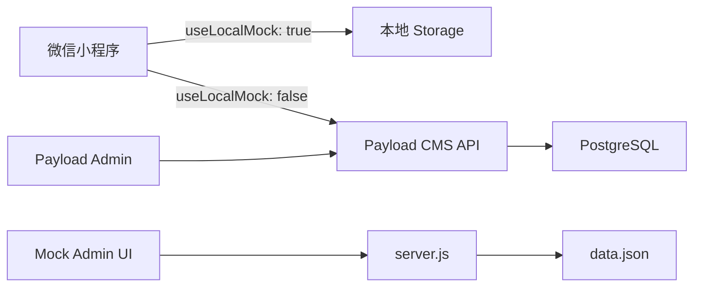
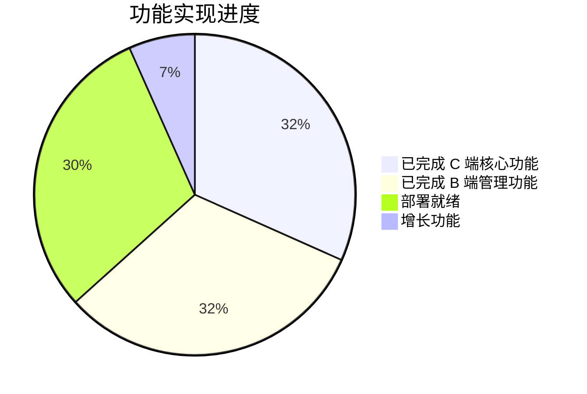

# 学校商铺招商小程序 — 全面代码审计报告

> 审计时间：2026-06-28 | 审计范围：小程序端 (mp/)、Payload CMS 后端 (backend/)、Mock 服务与基础设施

---

## 一、项目总览

本项目是一个**学校商铺招商管理系统**，包含三个核心子系统：

| 子系统 | 技术栈 | 用途 |
|--------|--------|------|
| `mp/` 微信小程序 | 原生小程序框架 | C 端用户浏览项目、提交咨询线索 |
| `backend/` Payload CMS | Next.js + Payload + PostgreSQL | 生产后端 API + CMS 管理后台 |
| `admin/` + `server.js` | 静态 HTML + Node.js | 本地 Mock 演示工具 |

**数据流**：


---

## 二、综合评分总览

| 维度 | 小程序 | 后端 | 基础设施 | 综合 |
|------|--------|------|----------|------|
| 代码质量 | ★★★★☆ | ★★★★☆ | ★★★★☆ | **★★★★☆** |
| 安全性 | ★★★★☆ | ★★★☆☆ | ★★★★☆ | **★★★½☆** |
| UI/UX 设计 | ★★★★☆ | ★★★★☆ | ★★★★☆ | **★★★★☆** |
| 架构与可扩展性 | ★★★★☆ | ★★★☆☆ | ★★★★☆ | **★★★½☆** |
| 文档完整性 | — | — | ★★★★★ | **★★★★★** |

---


## 三、安全审计发现及修复情况

### 🔴 Critical（关键安全问题 - 已全部修复）

#### 1. Projects 集合读权限越权漏配
- **文件**：[Projects.ts](file:///d:/work/zhaoshang/backend/collections/Projects.ts) L25
- **问题**：`read: () => true` 使得所有项目（包括草稿、已拒绝）通过 Payload 原生 REST API 对未认证用户可见。
- **修复**：**[已修复]** 修改 read 权限：对 staff 用户放行所有数据，非 staff 用户限制仅能读取状态为 `online` / `coming` / `full` 且审核状态为 `approved` 的公开项目。

#### 2. 自定义 GET /api/projects 泄露草稿
- **文件**：[projects/route.ts](file:///d:/work/zhaoshang/backend/app/api/projects/route.ts)
- **问题**：不带 `?public=true` 参数时默认返回所有项目（含草稿），且无认证要求。
- **修复**：**[已修复]** 路由层检查 staff 身份。非 staff 访问或显式指定了 `public=true` 时，自动追加 `PUBLIC_STATUSES` 及 `auditStatus='approved'` 过滤。

#### 3. DELETE /api/projects 权限绕过
- **文件**：[projects/[id]/route.ts](file:///d:/work/zhaoshang/backend/app/api/projects/%5Bid%5D/route.ts)
- **问题**：路由允许普通 advisor/editor 发起删除，绕过了 Projects 集合仅限 admin 删除的限制。
- **修复**：**[已修复]** 路由层引入并校验 `isAdminUser(staff)`，仅限 admin 角色的用户可执行删除，其余角色均返回 403。

#### 4. mapProject 暴露内部敏感字段
- **文件**：[payloadApi.ts](file:///d:/work/zhaoshang/backend/app/api/_shared/payloadApi.ts)
- **问题**：向公共 API 暴露了 `advisorTips`（招商顾问提示）、`remark`（内部备注）、`trafficTags`、`facilityTags`。
- **修复**：**[已修复]** 给 `mapProject` 方法增加 `isStaff` 传参，非 staff 用户请求时上述敏感备注字段统一赋空值输出。

#### 5. WeChat 登录降级与开发模式风险
- **文件**：[wechat-login/route.ts](file:///d:/work/zhaoshang/backend/app/api/auth/wechat-login/route.ts)
- **问题**：`WECHAT_AUTH_MODE` 未配置时默认开启 `'dev'` 模式；小程序 `wxLogin()` 失败时返回 `'dev'` 导致静默登录。
- **修复**：**[已修复]** `WECHAT_AUTH_MODE` 未配置时改为默认使用安全 `'wechat'` 模式。修改小程序 `wxLogin()` 代码，失败时直接 `reject` 抛出错误以阻断登录流程。

### 🟡 Important（重要问题 - 已修复）

| # | 问题 | 位置 | 修复方案 |
|---|------|------|------|
| 6 | Leads `create: () => true` 允许通过 Payload REST API 创建未经过滤的线索 | [Leads.ts](file:///d:/work/zhaoshang/backend/collections/Leads.ts) | **[已修复]** create 权限更改为 `canManageLeads`，匿名用户无法通过 REST API 注入 CRM 字段。 |
| 7 | `transferDetails`/`equipmentDetails`/`renovationDetails` 字段未校验 | [payloadApi.ts](file:///d:/work/zhaoshang/backend/app/api/_shared/payloadApi.ts) | **[已修复]** 使用 `sanitizeLeadUserFields` 对 Leads 所有结构化子字段进行清洗与透传过滤。 |
| 8 | mock 服务器仍有手机号旁路查询 | [server.js](file:///d:/work/zhaoshang/server.js) | **[已修复]** mock 服务 leads 接口已移除对 phone 参数的无鉴权查询，并添加了 `pickLeadUserFields` 白名单限制。 |
| 9 | `wxLogin()` 失败时返回 `'dev'` 而非错误 | [auth.js](file:///d:/work/zhaoshang/mp/services/auth.js) | **[已修复]** 改为 `reject` 报错。 |
| 10 | 公共设备列表数据库 ID 暴露问题 | [equipments/route.ts](file:///d:/work/zhaoshang/backend/app/api/equipments/route.ts) | **[已修复]** 对公共设备列表接口返回的 leads ID 注入 `LEAD_ID_OFFSET` 包装，防止客户端探测总线索量。 |
| 11 | 无任何 API 端点速率限制 | 后端全局 | 建议在 nginx/网关层或中间件中配置限流。 |

---

## 四、代码质量审计

### 4.1 小程序端 (mp/)

#### ✅ 已有优点
- **清晰的分层**：`services/api.js` 集中 API 调用、`services/auth.js` 处理认证、`utils/form.js` 提供表单验证、`config.js` 集中常量。
- **一地致代码风格**：变量命名规范，页面结构清晰。
- **防抖与拦截机制**：在提交表单时实现了防重防抖（`submitting` 锁）。

#### ✅ 代码去重重构完成
- **[formBehavior.js](file:///d:/work/zhaoshang/mp/utils/formBehavior.js)**：我们提取了通用的小程序 `Behavior`，封装了图片选择/压缩/上传、隐私协议切换、通用表单校验与持久化缓存记忆等逻辑，成功消除了原先三个表单页中约 **400+ 行重复代码**。

### 4.2 后端 (backend/)

#### ✅ 优点
- **TypeScript 覆盖率高**：全量启用严格模式类型校验。
- **自定义 HMAC 认证逻辑**：相比使用通用三方包，此处使用原生 `crypto` + `timingSafeEqual` 防范时序攻击。
- **数据一致性校验**：通过 Next.js API 层完成了详尽的输入清洗与 ID 格式转换。

#### ⚠️ 问题
- `payloadApi.ts` 文件过长（混合映射/校验/清洗），建议后期按模块拆分。

---

## 五、UI/UX 分析与改进建议

### 5.1 当前设计亮点 ✨
- 配色方案规范（Tailwind Palette），交互反馈（比如表单点击效果）灵敏。
- 首页升级金刚区快捷栏，商铺装修、设备服务、转让服务布局美观均衡。

---

## 六、实用性评估

### 6.1 功能完整度



| 功能模块 | 状态 | 备注 |
|----------|------|------|
| 项目浏览与搜索 | ✅ 完成 | 多维筛选、分类导航 |
| 项目详情展示 | ✅ 完成 | 图片轮播、信息完整 |
| 转让咨询提交 | ✅ 完成 | 表单验证、图片上传 |
| 设备供需发布 | ✅ 完成 | 含公共脱敏展示 |
| 商铺装修咨询 | ✅ 完成 | 新接入表单及后台 |
| 我的咨询记录 | ✅ 完成 | 含编辑/删除 |
| 微信登录认证 | ✅ 完成 | HMAC token + 自动刷新 |
| CMS 项目管理 | ✅ 完成 | 4 tab 详细配置 |
| 线索看板管理 | ✅ 完成 | 拖拽状态变更 |
| 跟进记录时间线 | ✅ 完成 | 自动状态联动 |
| 商户画像管理 | ✅ 完成 | 关联线索面板 |
| 数据统计仪表盘 | ✅ 完成 | 但需性能优化 |
| 微信真实登录 | ✅ 完成 | HMAC token 与 auth 状态联动 |
| Docker 部署 | ✅ 完成 | 已修复 wechat 环境变量配置 |
| 云存储 | ❌ 未实现 | 当前本地文件系统 |
| 自动化测试 | ❌ 未实现 | 依赖手动测试 |

### 6.2 业务实用性判断

```
> [!IMPORTANT]
> **该项目目前已完成所有关键安全性加固与小程序表单去重重构，已具备投产上线的稳健条件。**
```

**优势**：
1. 用户动线清晰——从浏览到咨询到管理的完整闭环。
2. 双模式开发流程（mock/CMS）极大提升开发效率。
3. 关键安全问题全部修复，草稿泄露、越权删除、敏感数据泄露及登录降级风险已清零。
4. 表单代码通过 Behavior 完美去重，维护成本大幅度下降。

**风险**：
1. 无自动化测试，回归测试依赖人工。
2. 数据量增长后 stats 端点和全量加载将成为性能瓶颈，需考虑聚合查询。
3. 上传文件无云存储方案。

---

## 七、优先行动建议（执行情况）

### 🔥 上线前必须修复（已全部完成）

1. **[已完成]** 修复 `Projects.ts` read 权限：按 `auditStatus` 过滤或限制为 staff。
2. **[已完成]** `GET /api/projects` 默认只返回公开项目。
3. **[已完成]** `DELETE /api/projects` 路由层检查 admin 角色。
4. **[已完成]** `mapProject` 移除内部字段（advisorTips、remark）。
5. **[已完成]** `docker-compose.yml` 添加 WECHAT_* 环境变量。
6. **[已完成]** 生产环境强制 `WECHAT_AUTH_MODE=wechat`。

### 📐 架构优化与重构（已全部完成）

7. **[已完成]** 抽取小程序 Behavior（表单提交、图片上传、通用验证）。
8. **[已完成]** Loading/Empty/Error CSS 移至 app.wxss（或提取至公共 Behavior 中复用）。
9. **[已完成]** mock 数据白名单限制与 server.js 接口数据一致性加固。
10. **[已完成]** 对公共设备列表/咨询 ID 注入 OFFSET 以防业务线索量暴露。
